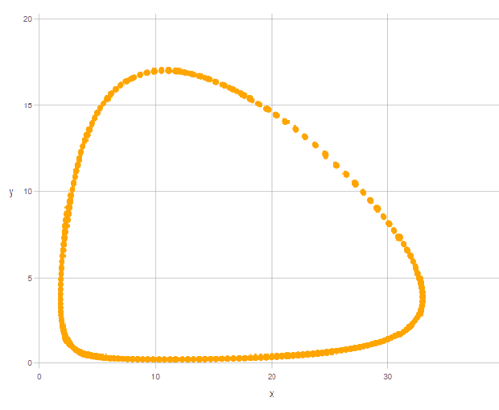
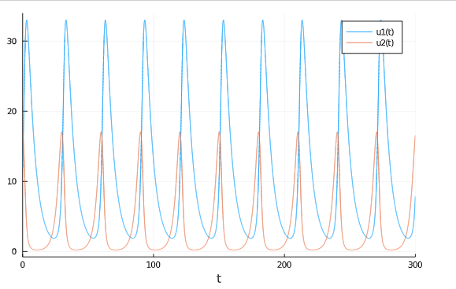

---
## Front matter
lang: ru-RU
title: Модель гармонических коллебаний
author: | Швец С.
institute: |
	\inst{1}RUDN University, Moscow, Russian Federation
date: 2021, 06 Marср
## Formatting
toc: false
slide_level: 2
theme: metropolis
header-includes:
 - \metroset{progressbar=frametitle,sectionpage=progressbar,numbering=fraction}
 - '\makeatletter'
 - '\beamer@ignorenonframefalse'
 - '\makeatother'
aspectratio: 43
section-titles: trueы
---

# Выполнение работы

## Цель работы и задачи

**Цель:** Изучить и построить модель хищник-жертва(модель Лотки-Вольтерры)

**Задачи:**

- Изучить жесткую модель хищник-жертва
- Изучит модель хищник-жертва с малым изменением
- Построить жесткую модель хищник-жертва

# Выполнение лабораторной работы

## Задача

**Вариант 7**

Для модели «хищник-жертва»:

$$
\begin{cases}
\frac{dx}{dt} =  -0.18x(t) + 0.047x(t)y(t)
\\
\frac{dx}{dt} = 0.38y(t) - 0.035x(t)y(t)
\end{cases}
$$

Постройте график зависимости численности хищников от численности жертв, а также графики изменения численности хищников и численности жертв при следующих начальных условиях: $x_0 = 12, y_0 = 17$. Найдите стационарное состояние системы.


## Решение

**Коэффиценты:**

- a= 0.18 // коэффициент естественной смертности хищников
- b= 0.38; // коэффициент естественного прироста жертв
- c= 0.047; // коэффициент увеличения числа хищников
- d= 0.035; // коэффициент смертности жертв

**Начальные значения:**

- $x_0 = 12$
- $y_0 = 17$

## Решение


Зададим СДУ и решим ее:

```

    function syst(dy,y,p,t)
        dy[1] = -a*y[1]+c*y[1]*y[2]
        dy[2] = b*y[2]-d*y[1]*y[2]
    end

y_0 = [x0, y0];
tspan = (0, 300);


prob = ODEProblem(syst, y_0, tspan);
sol = solve(prob, RK4(),reltol=1e-6, timeseries_steps = 0.01);

```

## Решение


Перепишем значения решения СДУ в массив для удобства рисования графика

```
N = length(sol.u)
    J = length(sol.u[1])
    U = zeros(N, J)

    for i in 1:N, j in 1:J
        U[i,j] = sol.u[i][j]
    end

```


## Решение

Выводим график зависимости численности хищников от численности жертв

```
set_default_plot_size(20cm, 15cm)
Gadfly.plot(x = U[:,1], y = U[:,2],
Theme(  discrete_highlight_color=x->"orange",
                default_color="orange",
                key_title_color="black",
                background_color="white",),)

```
## Решение

Выводим график изменения численности хищников и численности жертв:

```
Plot.plots(sol)

```


## Решение: График №1

График зависимости численности хищников от численности жертв(рис. -@fig:001)


{ #fig:001 width=70% }


## Решение: График №2

График изменения численности хищников(u1(t)) и численности жертв(u2(t)):

- u1(t) - изменение численности хищников
- u2(t) - изменение численности жертв


{ #fig:002 width=70% }


# Выводы

Мы изучили и построили модель хищник-жертва
